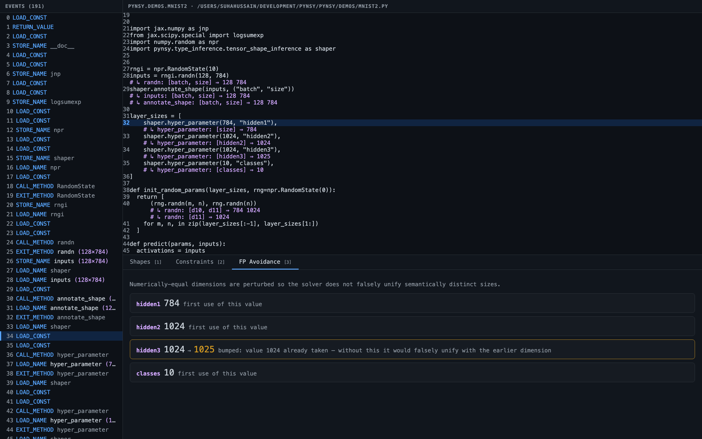

# Pynsy: Python Analysis Framework

Pynsy (pronounced "pin-sy") is a framework for writing heavyweight dynamic
analyses for Python programs.

Pynsy instruments Python bytecode of a target application on-the-fly and
provides a hook to log or inspect each Python bytecode being executed along with
dynamic information about the operands involved in the bytecode. In the
distribution you will find several analyses.

Currently, Pynsy supports Python 3.10 and earlier.

*This is not an officially supported Google product.*

## Installation

Run the following command to install Pynsy.

```bash
pip3 install -e .
```

## Running a custom dynamic analysis

Use the following command to run a custom analysis defined in `config.json`.

```bash
python3 -m pynsy.main --config <config> --module <module> -- <arguments...>
```

```bash
# Instrument expensive operations in Python, like a dynamic analysis linter.
#
# Example: catch expensive list membership (`x in list`) calls.
# These calls could be optimized using `set` or `dict`.
python3 -m pynsy.main --config configs/lint.json --module pynsy.demos.key_in_list
```

```bash
# Run tensor shape analysis on JAX MNIST.
python3 -m pynsy.main --config configs/tensor_shape_inference.json --module pynsy.demos.mnist
```

```bash
# Instrument a module that does flag-parsing.
# Use `--` to separate Pynsy flags from instrumented module flags.
python3 -m pynsy.main --config configs/lint.json --module pynsy.demos.flag_parsing \
  -- --string "Hello world" x y 10
```

## Processing analysis results

When Pynsy instruments a program, it records information about every load,
store, and application (e.g. application of a binary/unary operator or
invocation of a method) instruction executed by the program in order.

Program trace information is represented as a sequence of records. Saving
program traces as a table (e.g. CSV file) enables further analysis using
`pandas` or other data analytics frameworks.

Each record has the following keys:

-   `module_name`: the unique method id whose instruction has generated the log.
-   `method_id`: the unique method id whose instruction has generated the log.
-   `instruction_id`: the unique instruction within the method which generated
    the log.
-   `lineno`: line number of the program such that compilation of the statement
    at the line number resulted in the instruction bytecode.
-   `type`: type of the bytecode instruction.
-   `indentation`: the indentation of the instruction being executed. This helps
    to capture the recursive organization of the instructions.
-   `before`: whether the log appears before executing the instruction or not.
-   `result_and_args`: the result produced by the execution of an instruction.
-   `name`: the name of the variable or attribute, if the instruction accesses
    the value of the variable or the attribute.
-   `function_name`: the name of the function being called.

## Writing a custom dynamic analysis

One can write a custom dynamic analysis for Python instructions by creating a
Pynsy analysis class of the form
[analyses/tensor_shape_inference.py](pynsy/type_inference/tensor_shape_inference.py).

An analysis should define the following functions:

```python
def abstraction(obj: Any) -> tuple[bool, Any]:
  """Returns an abstract representation of the given object.

  Args:
    obj: The object to abstract.

  Returns:
    A tuple `(bool, Any)` where the first value indicates whether the
    abstraction should track the location of the object, and the second value
    is a finite abstraction of the object.
  """

def process_event(record):
  """Process each instrumentation event as it is generated."""

def process_termination():
  """Process the list of generated events at the end of analysis."""
```

Typically, analyses process only specific Python instruction types (e.g.
function calls, or loads and stores) and ignore others.

## Research papers

> **"Dynamic Inference of Likely Symbolic Tensor Shapes in Python Machine Learning Programs"**
>
> Koushik Sen, Daniel Zheng.
>
> In _Proceedings of the IEEE/ACM 46th International Conference on Software Engineering: Software Engineering in Practice (ICSE-SEIP 2024)_. ([PDF preprint](https://storage.googleapis.com/gweb-research2023-media/pubtools/pdf/f4c7d2ebfbf919c19bec9f58565c1a2f865f7e98.pdf))

## Visualizer

The analysis visualizer is a web-based HUD that lets you *see* tensor-shape
inference end-to-end — from raw execution events, through constraint solving, to
the symbolic shape annotations — including the hyper-parameter perturbation that
prevents falsely unifying numerically-equal-but-semantically-distinct dimensions.



It has three panels:

- **Events** (left): a scrollable timeline of execution events; rows that carry a
  tensor shape are highlighted (e.g. `randn (128×784)`). Step through with the
  `↑`/`↓` arrow keys.
- **Source** (top right): the instrumented source with inline magenta shape
  annotations (`# ↳ inputs: [batch, size] ⇒ 128 784`). The current event's line
  is highlighted.
- **Analysis** (bottom right), three tabs (keys `1`/`2`/`3`):
  - **Shapes** — per-line symbolic and concrete shapes.
  - **Constraints** — variable assignments, the template matches the solver
    used (✓/✗ with the supporting evidence), and the resulting equivalence
    classes. Click a `v`N variable to cross-highlight its appearances.
  - **FP Avoidance** — the `hyper_parameter()` perturbations, e.g.
    `hidden3 1024 → 1025`, showing which dimension would have been falsely
    unified without the bump.

### Usage

The visualizer is a two-step flow: run the analysis to capture an enriched
trace, then serve it.

```bash
# Step 1: run the analysis to produce outdir/visualizer/visualizer_trace.json
python3 -m pynsy.main --config configs/visualizer.toml --module pynsy.demos.mnist2

# Step 2: serve the HUD (opens http://localhost:8080 in your browser)
python3 -m pynsy.visualizer.server
```

The server has a few options:

```bash
python3 -m pynsy.visualizer.server --port 8080 \
  --trace pynsy/outdir/visualizer/visualizer_trace.json --no-open
```

To visualize a different program, point the `--module` flag at it (and adjust
`include`/`exclude` in `configs/visualizer.toml` to match its package).
